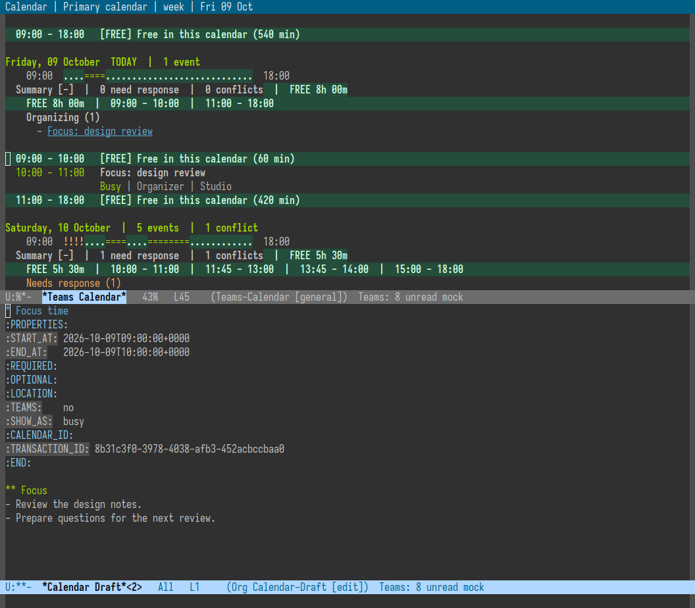
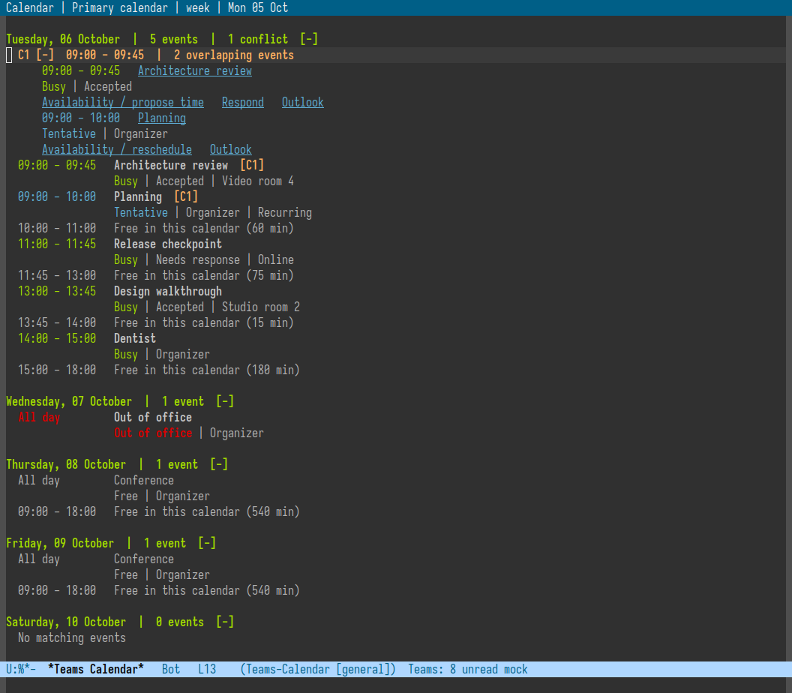
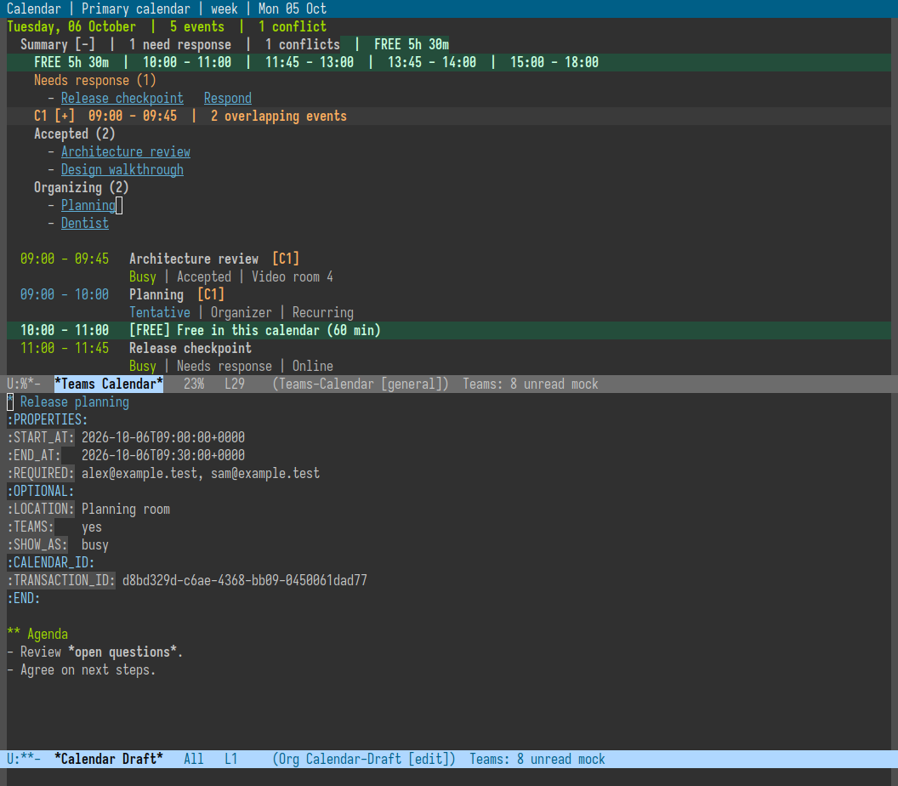

# Independent Calendar

`M-x teams4e-calendar` opens your Microsoft 365 calendar without loading Teams
chats. It includes ordinary appointments, focus blocks, all-day and multi-day
events, invitations, and each recurring occurrence in the displayed range.
`teams4e-meetings` remains the chat-oriented meeting view.

## Daily Use

The default is a chronological, day-grouped week agenda. Times use the Emacs
machine's local timezone; week boundaries respect `calendar-week-start-day`.
The time interval has its own fixed-width area, while titles and metadata wrap
rather than being squeezed into narrow columns. Dates are local calendar dates,
so moving by a day across DST does not assume every day has 24 hours.

| Default key | Action |
| --- | --- |
| `j / k`, `M-j / M-k`, `J / K`, `n / p` | Next / previous summary item; in the timeline, next / previous event |
| `h / l`, `H / L` | Center on the previous / next highlighted day heading; no fetch inside the loaded range |
| `[ / ]` | Previous / next day, week, or month |
| `d / w / m` | Day / week / month agenda |
| `S` | Toggle compact / duration-scaled agenda blocks locally |
| `F` | Choose a future free slot of at least 30 minutes in this range |
| `C-u F` | Choose a different minimum free duration |
| `s` | Jump to a visible meeting through completion, without changing filters |
| `W` | Jump to the overview of the loaded range |
| `?` | Contextual actions with your currently active bindings |
| `}` / `{` | Next / previous conflict; unfold its meeting actions |
| `B` | Draft a personal focus block in a fitting free slot |
| `!`, `C-u !` | Next / previous unanswered upcoming invitation, wrapping within visible events |
| `t` | Center on now, or the closest timed row today |
| `N` | Ongoing / next timed slot; tomorrow after today\'s last slot |
| `.`, `G` | Choose a date using Org's date reader and calendar |
| `TAB` | Fold / unfold a Summary heading or conflict group; no effect on the timeline |
| `RET` | Read an event or activate its action button |
| `/` | Filter subject, location, or organizer; empty input clears |
| `x` | Include / hide declined and cancelled events |
| `c` | Choose a calendar returned by Microsoft Graph |
| `+` | Compose a new single timed event in an Org draft |
| `a` | Accept, tentative, or decline |
| `f` | Follow in Outlook: open the invitation; choose Follow there |
| `r`, `A` | Availability workspace: propose a time, or reschedule your own event |
| `T` | Open the invite's Teams chat directly, without scanning recents |
| `v` | Join an online meeting |
| `o` | Open the event in Outlook, or the calendar when no event is selected |
| `C` | Org capture: title, link, time, location, and event ID |
| `g` | Refresh the displayed range |
| `q` | Quit the current pane |

### Overview And Actions

`W` (`teams4e-calendar-overview`) brings the compact overview to the top of the
window. The week agenda shows seven day rows; day/month views summarize their
own loaded range, without fetching or switching to a different range. Select a
row with `RET` to jump into that day's agenda. `j/k` traverse overview rows too.
Customize `teams4e-calendar-show-overview` to hide the table by default; `W`
enables it locally. Normal opening still centers on the current time.

**Events** counts time-blocking entries, including focus and out-of-office
blocks, not only Teams meetings. **Clashes** counts the exact overlapping
intervals used by the day summary; **Reply** counts unanswered invitations.
These counts cover the whole day. **Blocked**, **Free**, and **Longest** cover
configured working hours. Overlapping occupied intervals are counted once.
Free totals include short gaps hidden by the agenda's minimum-gap setting;
Longest is the longest uninterrupted free interval. Nonworking-day durations
are `--`, not zero. The overview ignores text filters, excludes declined,
cancelled and nonblocking entries, and never estimates free time from a stale,
loading, or incomplete snapshot. It describes this calendar only.

`?` (`teams4e-calendar-actions`) opens an ordinary Emacs completion menu in the
agenda or invitation reader. It offers relevant event, free-slot, section, and
navigation actions. Organizers are not offered RSVP; entries without an online
link are not offered Join. Labels show **effective bindings in the current
buffer and Evil state**, including your customizations, or an `M-x` fallback
when no active key invokes that command. No Transient dependency is required.
Opening or cancelling the menu does not fetch or change anything; choosing an
action invokes its normal command. If the target disappears while you choose,
the menu aborts rather than acting on a different meeting.

First load centers on the ongoing or nearest timed row. Explicit refreshes keep
your selected occurrence, line, column, and screen row, independently in every
agenda window. Unchanged content keeps the exact scroll position. If a summary
or conflict row disappears, its event's timeline row is preferred; otherwise
point falls back to a surviving neighboring item, then the day heading. Positions
are clamped when text shrinks or a buffer boundary prevents the old screen row.
Reopening resumes your position. A response arriving while you move through the
agenda preserves your current position, not where you were when loading began.

`t` recenters without fetching when today is already loaded. `N`
(`teams4e-calendar-next-slot`) excludes ended rows and chooses the ongoing or next
event/free slot. After today's last timed slot it visits tomorrow; an empty day
lands on its heading. When today's snapshot is not loaded, invoking `N` after
configured work hours also starts on tomorrow. Navigation reuses the loaded
range, fetching only the displayed day/week/month when necessary, not scanning
indefinitely for a future appointment.

The time and availability label use theme-aware faces: `teams4e-calendar-busy`,
`-tentative`, `-out-of-office`, `-elsewhere`, and `-free`. Actual available gaps
use the separate `teams4e-calendar-free-slot` face: bold text with a green-tinted
full-width background (including the newline) and an explicit `[FREE]` label.
Free/following invitations remain
subdued, so a non-blocking appointment cannot be mistaken for an available slot.
Free and declined/cancelled events have subdued titles. RSVP remains separate
text: accepting a "free" invitation does not make it look busy.
A `>` marks a timed row covering now when the agenda is rendered.

The compact agenda is the default. `S` (`teams4e-calendar-toggle-duration`)
makes longer meetings and free intervals taller, using 30 minutes per logical
line. Customize `teams4e-calendar-duration-scaled` to start in this view, and
`teams4e-calendar-minutes-per-row` to change its scale. Blocks use at least two
and at most twelve lines; all-day entries stay compact. Event durations are
clipped to the displayed local day, with a duration label on timed meetings.
Text can still wrap. This remains a chronological agenda, **not a spatial time
grid**: overlapping meetings are separate blocks, not extra elapsed time.
Toggling does not fetch data or change your selected event.

[Duration-scaled agenda in real Emacs with Moe](assets/calendar-duration.png)
shows the same synthetic calendar with its summary folded and longer free
intervals taking more space. The compact agenda screenshots use the default.

Free gaps describe **this calendar only**, not all your calendars. Busy,
tentative, out-of-office, and unknown availability block time; free,
working-elsewhere, declined, and cancelled events do not. Overlapping blocks
are merged before gaps are calculated, using the complete unfiltered snapshot.
No gaps are inferred during loading or after an incomplete response.

### Plan From The Agenda

A compact **day map** sits below each working-day heading. Each pair of
characters represents thirty minutes: `..` free, `==` occupied, `!!` a real
overlap, and `??` unknown availability. The endpoints show your working hours.
Hover a cell for its interval and event titles; `RET` or a click moves to the
nearest visible agenda entry at that time. The map uses the full snapshot even
when a text filter hides events. Any occupied part marks the whole cell occupied;
two back-to-back events in one cell are not a conflict. The exact gap rows and
event times remain authoritative. Loading/incomplete snapshots never show this
map, and `teams4e-calendar-show-day-map` can disable it.

`F` (`teams4e-calendar-find-free-slot`) offers future free intervals using ordinary
Emacs completion, sorted by time. It searches only the displayed range and uses
the same working hours and minimum-gap settings as the agenda. `C-u F` asks how
many minutes you need. An ongoing gap starts at the next five-minute boundary,
not in the past. The choices state the remaining duration and timezone.

After choosing a gap, `+` starts an editable Org draft inside it. Its default
duration is shortened when needed to fit the gap, including when point is on a
scaled gap's continuation line. Elapsed slots and incomplete data are rejected.
The gap is **not reserved**; availability may change before submission. Edit the
time or people normally, and only `C-c C-c` creates the event and sends invitations.
Finding time and opening the draft make no requests.

`!` (`teams4e-calendar-next-response`) cycles through visible invitations that
have no RSVP and have not ended; `C-u !` goes backward. It skips accepted,
tentative, declined, free/following, and organizer entries, respects the text
filter, and visits each invitation's timeline row rather than its summary copy.
Respond with the existing `a` action. Navigation itself never sends a response.

`s` (`teams4e-calendar-jump-event`) offers the visible timeline occurrences
through completion, including their dates, times, titles and response states.
Duplicate titles remain individually selectable. It does not clear your filter,
include summary duplicates, or fetch another range.

`}` and `{` (`teams4e-calendar-next-conflict` / `teams4e-calendar-previous-conflict`)
cycle through exact conflict intervals in the loaded range. They open the
target day's Summary and the selected conflict so its action buttons are ready.
Other folds and your text filter are preserved. Hidden partners remain included:
a filter must not hide a scheduling collision. Browsing conflicts never responds,
reschedules, or fetches events.

`B` (`teams4e-calendar-block-time`) asks for a focus duration, initially 60 minutes
(`teams4e-calendar-focus-duration`). It uses the free slot at point when it fits;
otherwise completion offers suitable slots in the loaded range. It opens an Org
draft titled **Focus time**, marked Busy, with no attendees and no Teams link.
The standard meeting defaults are unchanged. Edit the title or notes as usual;
only `C-c C-c` saves the block to the selected calendar. No time is reserved while
you draft, and this still considers only the selected calendar's availability.



This synthetic example freezes the planning clock at 08:00; it opens a draft
for the next free hour without submitting anything to a calendar service.

Overlap summaries appear just below the day heading, with exact intervals and
labels such as `C1`. The affected event titles carry matching labels. This
does not replace their busy/free colors. Back-to-back events do not conflict;
free, working-elsewhere, declined, and cancelled entries are excluded. Tentative
and unknown availability conservatively count as blocking time.

Three-way overlaps show the actual simultaneous count, not misleading pair
counts or transitive groups. Filtering cannot hide the existence of a clash:
summaries say how many affected events are filtered out.

Each day has an independently foldable **Summary**, above its chronological
timeline. It starts open and shows available intervals plus their combined
duration, then **Needs response**, foldable conflicts, **Tentative**, **Accepted**,
and **Organizing**, in that order. Empty meeting groups are omitted. Within each
group, titles follow start time, without repeating time/location details. Titles
open invitations; unanswered and tentative invitations also have a Respond
button. The normal `a`, `r`, `o`, and capture commands work on these rows too.
In **Accepted**, a `[Cx]` marker means an overlap with another **accepted**
blocking meeting, even if that partner is filtered out. Tentative/unanswered-only
clashes do not add this marker to Accepted. Numbers retain their meanings in the
full day's conflict list; the timeline still marks all blocking overlaps.

Unanswered means an attendee invitation with no response, not an ordinary
appointment or an event you organize. Declined, cancelled, free/following, and
working-elsewhere entries are excluded from the summary's meeting lists, even
when `x` exposes them in the timeline. Lists respect the text filter; conflicts
and free slots continue to use the full snapshot. The free-time total sums the
shown slots within your configured working hours and minimum-gap threshold,
not every minute in a 24-hour day. Partial/loading data never claims free time.

`TAB` on the Summary heading hides only its summary; the day and timeline stay
visible. Conflicts start collapsed and keep their own expansion when the summary
is closed and reopened. On day headings, ordinary event rows (including summary
meeting lists), free gaps, or blank lines, TAB does nothing. Folding and local
filtering do not fetch anything. `H/L` reach day headings. From a day heading or
inside a summary, `j/k` visit the Summary heading, free-time summary, category
headings, meeting titles, and expanded conflict entries in display order.
Metadata and action-button lines do not create extra stops. Once in the timeline,
they move between timeline event titles, skipping gaps and summaries. `M-j/M-k`
are aliases in both ordinary Emacs and Evil normal/motion states; `t` recenters
on now.

Expand a conflict to see **every involved meeting**, including filtered-out
partners, with its full interval, availability, and RSVP state. Click its title
(or use `RET` on the meeting row) to read the invitation. Use `r` for
availability/rescheduling, `a` to respond (including decline), or `o` for Outlook.
The same actions are buttons under each meeting; `RET` activates a button at
point. Your own events offer rescheduling; received invitations offer time
proposals and RSVP. Folding or browsing never changes an invitation. Successful
responses and moves update the original snapshot and recompute the conflicts;
a proposal alone does not resolve a clash until the organizer changes the time.

The invite reader also links to overlap partners and their exact shared
intervals, reusing the same pane.
As with free gaps, overlap detection covers only the loaded selected calendar.



The [invite detail](assets/calendar-conflicts.png) and expanded agenda above use
real Emacs with Moe and window-purpose, with synthetic appointments only.
The capture fixture uses daily working hours so the demo also shows free time
when run on a weekend; the package's default working days remain Monday-Friday.

These are ordinary, customizable Emacs keymaps:
`teams4e-calendar-mode-map` and `teams4e-calendar-event-mode-map`.
Evil uses motion state with the local calendar map taking precedence.
The event reader also provides RSVP, availability, join, Outlook, and capture
commands, plus clickable Teams-chat and availability actions. Text selection
and copying use normal Emacs behavior. The availability workspace retains its
own bindings; its existing `J` join shortcut is unchanged.

Invitations accept without notifying the organizer when the acceptance note is
empty, matching the existing meeting action. Other response types retain their
existing backend behavior. `r` or `A` opens the same day timeline, availability
ranking, proximity ranking, and participant-block sheet used by Teams meetings.
Selecting a slot with `RET` sends the action; browsing slots never does.

For an invitation, this sends a new-time proposal (with a note to the organizer).
For an event you organize, it moves that **single occurrence**, updating only
start/end and allowing Outlook to notify attendees. No second confirmation is
added. The workspace identifies this organizer action explicitly. Recurrence-rule
changes, all-day moves, and cancelled events remain in Outlook; a series master
cannot be moved accidentally. Outlook can reject an occurrence moved across
adjacent occurrences. Prohibited attendee proposals remain prohibited.

Reopening `teams4e-calendar` resumes the buffer without a request. Use a prefix
argument to refresh. Filtering is entirely local. Visiting a different date
range replaces the single loaded snapshot. This is not a persistent offline
calendar database: an existing buffer remains readable offline, but a new range
requires a working token and network.

## Create a Meeting

Press `+` in the agenda, or run `M-x teams4e-calendar-create`. This opens an
editable Org draft beside the calendar. Opening the draft does not fetch or send
anything. The first heading is the title; the text below its property drawer is
the description, exported to HTML with the same safe Org renderer as chat replies.
Includes, setup files, macros, and executable export directives are rejected.

The drawer contains `START_AT` and `END_AT` (ISO timestamps with an explicit UTC
offset), `REQUIRED` and `OPTIONAL` (comma-separated email addresses), `LOCATION`,
`TEAMS` (`yes` or `no`), and `SHOW_AS`. The selected calendar is retained in
`CALENDAR_ID`; an empty value means the primary calendar. Keep `TRANSACTION_ID`:
it allows Graph to recognize retries of the same creation request.

| Default draft key | Action |
| --- | --- |
| `C-c C-t` | Choose start time with Org's date reader and enter a duration |
| `C-c C-a` | Search the existing directory and add a required attendee |
| `C-u C-c C-a` | Add an optional attendee |
| `C-c C-c` | **Create the event and send invitations** |
| `C-c C-k` | Leave the draft pane without submitting; the draft remains a buffer |

The default duration is 30 minutes and a Teams link is requested by default.
Customize `teams4e-calendar-new-duration`, `teams4e-calendar-new-online-meeting`,
and `teams4e-calendar-compose-mode-map`. Without attendees, the draft creates an
appointment. Set `TEAMS` to `no` for an ordinary non-online event. No hidden
confirmation step follows `C-c C-c`: inspect the draft before invoking it.

An in-flight draft cannot be submitted twice. Success records `CREATED_ID` and
updates the owning agenda snapshot when the event is in its loaded range.
Failures retain the draft, and retrying an unchanged draft uses the same request
and transaction ID. After an ambiguous timeout, **check Outlook before replacing
or changing the submitted draft**. Changed submissions are blocked to avoid
accidentally sending a second invitation. `C-c C-k` does not cancel a request
already in flight, nor delete an event already created.

This first version creates single timed events only: no recurrence, all-day
creation, attachments, room booking, or participant-availability picker before
creation. Existing events still have their availability/rescheduling workspace.
Creation uses the selected user's calendar and existing token, requiring already
authorized `Calendars.ReadWrite`; teams4e does not request more permissions.
Teams-link availability depends on the account/calendar's supported providers.
See Microsoft's [create-event API](https://learn.microsoft.com/en-us/graph/api/calendar-post-events?view=graph-rest-1.0).



The calendar images use synthetic data in Emacs 29.3 with Moe Dark and Iosevka.
See [capture provenance](assets/calendar-capture.json) and the
[folded summary with its timeline still visible](assets/calendar-summary-closed.png).

## Follow: Current Limitation

Official documentation checked on 2026-10-05. Outlook's **Follow** is a distinct
response: the organizer receives a Follow notification and may receive recording
reminders, while the attendee retains meeting/chat access with free availability.
It is not simply Tentative plus Free. Availability depends on the Outlook version,
meeting settings, and rollout. See [Microsoft's Follow documentation](https://support.microsoft.com/en-us/outlook/calendar/follow-a-meeting-in-outlook).

No documented true Follow operation was found in the published Graph
[event methods (v1.0)](https://learn.microsoft.com/en-us/graph/api/resources/event?view=graph-rest-1.0)
or [beta methods](https://learn.microsoft.com/en-us/graph/api/resources/event?view=graph-rest-beta).
The [v1.0 responseStatus](https://learn.microsoft.com/en-us/graph/api/resources/responsestatus?view=graph-rest-1.0)
and [beta responseStatus](https://learn.microsoft.com/en-us/graph/api/resources/responsestatus?view=graph-rest-beta)
contracts do not include Follow either. Therefore teams4e does **not** offer
native Follow, write guessed extended properties, use private Outlook endpoints,
or infer Follow from a tentative/free event. Such events remain non-blocking
based on their reported availability, without claiming to know their Follow state.

The **Follow in Outlook** handoff (`f`, or the invite-reader button) opens the
selected invitation using its Graph-provided `webLink`. Choose **Follow** in
Outlook yourself, then use `g` to refresh. There is no documented direct-action
deep link that follows an invitation just by opening a URL. No response or
availability changes locally when you open it. Microsoft's documented legacy
OWA item links are converted to modern calendar item links; no guessed action
parameters are appended. Missing/unsupported links fail clearly instead of
silently opening a different meeting.

`teams4e-calendar-follow-browser-command` controls opening. Its default `auto`
requests background opening with macOS `open -g`, retaining an existing
`teams4e-browser-command` that uses `open -a` (for example Arc). Otherwise macOS
uses its default browser. Other platforms use `teams4e-browser-command` or
`browse-url`. Browser focus/tab behavior is not guaranteed; no global settings,
automation permissions, or security preferences are changed. Set the option to
your own argv list for browser-specific behavior, or nil for `browse-url`.
The URL is passed as one argument, never interpolated into a shell command.

## Setup

Use the same backend, external Graph token provider, and authentication settings
as teams4e. No separate app registration or new login flow is introduced.
This does not bypass tenant permissions: calendar read access must already be
authorized for that token, and responses/proposals need calendar write access.
See [authentication](AUTHENTICATION.md).

Update **both** the Lisp package and your installed Python backend. A deployment
that copies `teams4e-graph` and its Python modules outside the checkout must
reinstall those files too, including the new `teams4e_calendar.py` sibling module.
Copy the complete `bin/` runtime, not just the launcher or `teams4e_graph.py`.
Restart the persistent backend or Emacs afterward.
An older backend will reject the new `teams calendar` commands.

Check `M-x find-library RET teams4e-calendar RET` for the Lisp installation and
`C-h v teams4e-backend-program` for a separate staged backend. Updating a source
checkout alone does not replace either running component. For Spacemacs/Quelpa,
update the installed package (retaining the recipe's `bin/*` files), run your
deployment's backend installer if it stages a separate copy, then restart Emacs.
Save drafts and wait for pending submissions before updating or stopping a backend.

For Lisp-only calendar updates in an existing session, evaluate with `M-:`:

```elisp
(progn
  (load "teams4e-calendar.el")
  (load "teams4e-calendar-ui.el")
  (teams4e-calendar))
```

This reinstalls the agenda's buffer-local Evil navigation bindings and redraws
from the current snapshot without fetching. The invite pane uses a standard
Emacs display action that is also tested with Spacemacs' window-purpose enabled.
Reopen an invitation to install the new reader binding in an existing pane.
For this creation update, reload `teams4e-calendar-create.el` as well if it was
already loaded. After staging the Python files, an in-session backend restart is
possible with `(teams4e--stop-server "Backend updated")`; this is an internal
helper and will fail any pending requests, so use it only when idle. The next
backend operation starts the updated process. A full Emacs restart is simpler.

Example optional configuration:

```elisp
(with-eval-after-load 'teams4e-calendar
  (setq teams4e-calendar-default-view 'week
        teams4e-calendar-show-declined nil
        teams4e-calendar-work-hours '(9 . 18)
        teams4e-calendar-work-days '(1 2 3 4 5) ; Mon-Fri; use 0-4 for Sun-Thu
        teams4e-calendar-free-gap-minutes 15 ; nil hides gap rows
        teams4e-calendar-capture-key "t"))

;; Optional; teams4e does not install a global calendar shortcut.
(global-set-key (kbd "M-s C") #'teams4e-calendar)
```

`teams4e-calendar-id` selects a non-default calendar on first use. Interactive
calendar selection changes only this calendar buffer. Configure
`teams4e-calendar-outlook-url` for a different Outlook deployment if needed.

For a local synthetic calendar, enable the existing mock backend and open
`teams4e-calendar`. Reset or recreate older mock state to get the newly seeded
appointments. See [local testing](LOCAL-TESTING.md); reset affects only mock data.

## Architecture and UI Choices

The calendar owns one canonical list of Graph event objects for one loaded
range. Its detail pane retains an event ID and a reference to the calendar
buffer. It neither creates artificial chat objects nor writes a synchronized
copy of the calendar into Org files. Org capture is an intentional export.

The backend uses:
- `GET /me/calendars` for explicit calendar selection.
- `GET /me/calendarView`, or a selected calendar's `calendarView`, for the
  displayed range. Graph expands recurrence, including exceptions.
- `GET /me/events/{id}` for the full description on demand.
- Existing response, availability, and proposal APIs for event actions.
- `PATCH /me/events/{id}` for explicit organizer rescheduling, with only start/end
  in the request. See [Graph event updates](https://learn.microsoft.com/en-us/graph/api/event-update?view=graph-rest-1.0).
- `GET /chats/{id}` only when explicitly opening an invite's Teams chat.
  The thread ID comes from the meeting link and preserves its case. Short links
  without a thread ID currently fall back to join/Outlook; no speculative search
  through every chat is performed. See [Graph chat lookup](https://learn.microsoft.com/en-us/graph/api/chat-get?view=graph-rest-1.0).

Only the requested range is fetched, paginated serially with 100 events per
page. There is no per-chat matching or per-event enrichment on the agenda path.
Existing shared Outlook throttling and retry handling remain in force.
A later-page failure preserves returned rows and labels the view incomplete.
Late responses cannot replace a newly selected range.

The first UI borrows the readable agenda approach from Org Agenda and
[khal](https://github.com/pimutils/khal), and explicit date/view navigation from
[calfw](https://github.com/haji-ali/emacs-calfw). It works in terminal Emacs and
with variable-width themes without a graphical dependency.

This release uses **day/week/month agenda lists**, not a graphical time-block
grid. A calfw adapter or time-block view is a good next presentation layer, but
should consume these same event objects rather than introduce a second store.
[org-timeblock](https://github.com/ichernyshovvv/org-timeblock) is attractive for
Org tasks; importing Outlook events into Org solely to drive it would add the
synchronization problem this implementation deliberately avoids.

## Current Boundaries

- One selected calendar at a time; no merged multi-account calendar.
- No background calendar polling or persistent offline event cache.
- Create/delete, general editing, recurrence rules, all-day moves, and attendee
  changes open Outlook. Native actions include RSVP, proposals, moving your own
  timed occurrence, join/chat, and capture.
- No automatic export to Org Agenda or modification of Org task files.
- Validation uses unit tests and an isolated synthetic tenant, not an actual
  company account. Real tenant permissions and policy still need a user check.

See Microsoft's [calendarView API](https://learn.microsoft.com/en-us/graph/api/calendar-list-calendarview?view=graph-rest-1.0)
and [calendar listing API](https://learn.microsoft.com/en-us/graph/api/user-list-calendars?view=graph-rest-1.0).
