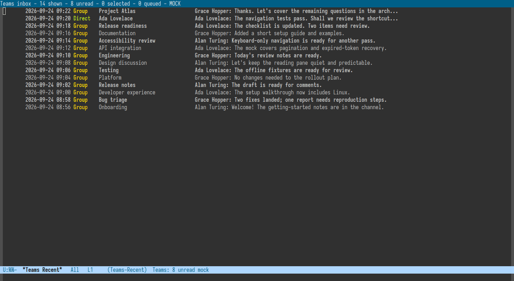

<p align="center">
  
</p>

<h1 align="center">teams4e</h1>

<p align="center">
  A mu4e-inspired Microsoft Teams client for Emacs.
</p>

<p align="center">
  <a href="https://www.gnu.org/software/emacs/"></a>
  <a href="https://www.python.org/"></a>
  <a href="LICENSE"></a>
</p>

`teams4e` turns Microsoft Teams into an Emacs workflow: one headers buffer,
one reusable reader, native compose buffers, bookmarks, deferred marks, Org
capture, and complete Markdown export. It uses Microsoft Graph through a
bundled standard-library-only Python adapter while leaving OAuth ownership to
an external token provider.



The demo uses the bundled local mock and the Moe Dark palette. It contains no
account or organization data.

## Why teams4e?

The official client is useful for calls and screen sharing. `teams4e` focuses
on the work around those calls: scanning conversations, reading without losing
context, replying, finding messages, triaging an inbox, capturing decisions,
and handing a complete thread to another Emacs workflow.

- A mu4e-style headers buffer with aligned status, date, type, conversation,
  meeting, favorite, and preview columns.
- One singleton reader buffer. Opening another conversation replaces it
  instead of leaving dozens of chat buffers behind.
- Chats, one-to-one conversations, group chats, meeting chats, teams,
  channels, channel posts, and replies.
- Read/unread state, favorites, reactions, edit/delete, reply, forwarding,
  attachments, and inline images.
- Bookmarks, composable unread filtering, saved searches, deferred marks,
  bulk actions, and undo.
- Linked calendar context for meetings: start/end interval, location,
  response, participants, organizer, and join link.
- A focused meeting workspace with overlap warnings, RSVP and join actions,
  ranked alternate times, a participant availability matrix, and a
  privacy-aware calendar-block sheet.
- Complete chronological Markdown export, clipboard copy, compact Org capture,
  full-thread Org capture, and optional `agent-shell` analysis.
- SQLite cache, cache-first opening, offline reads, background sync, and local
  search.
- Ordinary Emacs bindings and optional Evil bindings with the same operations.
- A persistent mock tenant for development and evaluation without Graph.

The package is not affiliated with or supported by Microsoft.

## Five-Minute Tour

Install directly from GitHub with Emacs 29's `package-vc`:

```elisp
(package-vc-install "https://github.com/guibor/teams4e")
```

For a credential-free first run, enable the mock and open the inbox:

```elisp
(setq teams4e-mock-mode t)
(teams4e)
```

`M-x teams4e` and `M-x teams` are exact aliases for the same
`teams4e-inbox` entry point.

Or interactively:

```text
M-x teams4e-mock-enable
M-x teams4e
```

The mock exercises the same argv/JSON backend contract as the Graph adapter.
Messages, reactions, edits, read state, searches, channels, exports, and
meeting metadata are real package behavior; only the remote service is fake.

## Installation

### package-vc

```elisp
(package-vc-install "https://github.com/guibor/teams4e")

(use-package teams4e
  :commands (teams4e teams4e-inbox teams4e-channels))
```

### Spacemacs or Quelpa

Include the bundled backend files in the recipe:

```elisp
(teams4e :location
         (recipe :fetcher git
                 :url "https://github.com/guibor/teams4e.git"
                 :files ("*.el" ("bin" "bin/*"))))
```

Then declare the package normally:

```elisp
(use-package teams4e
  :defer t
  :commands (teams4e teams4e-inbox teams4e-status))
```

### Requirements

- Emacs 29.1 or newer.
- Python 3.10 or newer. The backend has no third-party Python dependencies.
- For live use, an external program or credential broker that supplies a
  delegated Microsoft Graph access token.

Tenant policy and the token's delegated permissions determine which Graph
actions are available. Calendar enrichment is optional; meeting chats remain
readable when calendar access is unavailable. The availability workspace uses
`getSchedule` and `findMeetingTimes`; reading free/busy commonly needs
`Calendars.ReadBasic` and ranked suggestions commonly need
`Calendars.Read.Shared`. RSVP and new-time proposals need
`Calendars.ReadWrite`. Sharing policy may hide another participant's block
title or location even when free/busy is visible.

## Authentication

`teams4e` deliberately does not register an Entra application, start a device
code flow, store a refresh token, or become a second OAuth authority. It
consumes a short-lived Graph token from infrastructure you already trust.

### Token command

Configure an argv list. It is executed directly, without a shell:

```elisp
(setq teams4e-token-command
      '("my-m365-token-helper" "token" "--resource" "graph"))
```

The command may print a raw access token or one JSON object:

```json
{"access_token":"REDACTED","expires_at":1786123456}
```

`expires_at` may be Unix seconds or milliseconds. A JWT `exp` claim is also
accepted. Only the short-lived token is cached in backend memory; the command
runs again near expiry.

### Read-only credential store

The alternative interface reads a JSON file owned by another program:

```elisp
(setq teams4e-credentials-file "~/.config/my-m365/credentials.json"
      teams4e-credential-server-name "m365"
      teams4e-credential-server-url nil)
```

Candidate entries contain `server_name`, optional `server_url`,
`graph_access_token`, and `graph_expires_at`. An optional refresh owner can
update that file:

```elisp
(setq teams4e-bootstrap-program "/path/to/my-oauth-owner")
```

It is invoked as:

```text
HELPER --refresh-if-needed --credentials FILE
```

The package reads the result but never writes credentials or refresh tokens.
Keep the credential file readable only by your user.

## Daily Workflow

Run `M-x teams4e`, then use the headers buffer as the owner of navigation and
actions. The reader mirrors headers commands, so `j`, `k`, marking, bookmarks,
and filters continue to act on the conversation list even while point is in a
thread.

| Key | Action |
| --- | --- |
| `j` / `k` | Next/previous conversation, including from the reader |
| `RET` or `l` | Open the selected conversation |
| `r` or `i` | Queue mark-read |
| `R` | Reply |
| `c` or `C` | Compose a new message |
| `f` or `F` | Forward the selected/latest message |
| `o` / `O` | Open in browser / native Teams app |
| `b` | Choose a bookmark; `b m` opens upcoming meetings |
| `M-F` | Toggle unread-only filtering on the current view |
| `m` | Deferred-mark prefix |
| `x` | Apply deferred marks |
| `M` / `T` | Select one / all visible conversations |
| `X` | Choose and run a bulk action |
| `a` | Current-conversation action prefix |
| `a a` / `a A` | Capture a summary / complete thread to Org |
| `a e` / `a y` | Export / copy complete Markdown |
| `a g` | Export and analyze with `agent-shell` |
| `a p` | Open the meeting availability workspace |
| `a v` / `a J` | RSVP / join the meeting |
| `a C` | Open the linked Outlook calendar event |
| `G` / `L` | Load complete history / load more |
| `M-j` / `M-k` | Next/previous message inside the transcript |
| `q` | Close the reader or restore the previous window layout |

Use `M-x teams4e-dispatch` or `a ?` for discoverable action menus.

## Views and Meetings

Bookmarks filter the same canonical chat objects; they do not create a second
calendar inbox or synchronized copies.

Built-in symbols such as `all` and `upcoming` take precedence over functions
with the same Emacs symbol name. Custom function bookmarks remain supported.

| Bookmark | View | Default order |
| --- | --- | --- |
| `b i` | Relevant inbox | Newest last message first |
| `b a` | All chats, clearing unread-only and other overlays | Newest last message first |
| `b u` | Unread chats | Newest last message first |
| `b m` | Upcoming/in-progress meetings | Earliest meeting start first |
| `b M` | All meeting chats | Earliest known meeting start first |

Message-oriented views derive their date, unread state, and sort key from a
complete `lastMessagePreview` containing both an id and timestamp. A calendar,
membership, or topic update does not make a quiet conversation jump to the top
or become unread, and these views omit the meeting interval column. A meeting
chat without a complete message preview is omitted from message-oriented views
instead of appearing as an undated unread row; it remains available in `b m`,
`b M`, and explicit meeting queries. Meeting-only views add the schedule column,
sort by the linked event start, and show the complete start/end interval.

When the external token provider is logged out, the headers say to run
`M-x teams4e-login` instead of presenting an unexplained empty inbox. Calendar
request failures are recorded in `*M365 Errors*` and summarized in meeting-only
headers; chat and participant data remain usable.

Graph chat data may expose `onlineMeetingInfo.calendarEventId`. The backend
resolves direct IDs through Microsoft Graph JSON batches of at most 20 event
requests and merges the results into the existing chat alists. If a list row
omits the event ID, or a supplied ID is stale, an explicit meeting view performs
a bounded chat-metadata lookup. All still-unresolved join URLs then share one
bounded `calendarView` scan rather than scanning once per chat. Ordinary inbox
loads do not pay the missing-ID fallback cost, and one refresh never starts a
second enrichment wave automatically. Recent message-less meeting rows are
resolved before message-bearing meeting history within that bound. The
meeting-only headers schedule column and reader banner both render from that
one attachment.

### Meeting workspace

`M-x teams-meetings` or `b m` is the calendar-light daily entry point. It is
designed around five journeys:

1. **Scan:** see upcoming and in-progress meetings in start-time order, with
   complete intervals, response state, location, overlap warnings, and a header
   summary for the next meeting, conflicts, and invitations awaiting response.
2. **Inspect:** open the singleton reader for participants, organizer, join
   link, pending proposal, and the meeting chat without losing the headers row.
3. **Act:** use `a v` to accept/tentatively accept/decline, `a J` to join, or
   `a C` to open the linked Outlook event for advanced calendar editing.
4. **Negotiate:** use `a p` for the full-window `*Teams Availability*` buffer.
   It combines ranked Outlook suggestions with per-participant status and an
   exact calendar-block sheet. Private blocks never expose returned subject or
   location through this UI.
5. **Prepare and follow up:** use the existing compact Org capture, transcript,
   complete Markdown export, and agent-analysis actions from the same chat.

The availability buffer is a singleton and has two views. In **Suggestions**,
`j`/`k` selects a ranked interval and updates its exact conflict details;
`RET` sends that interval as a new-time proposal. In **Calendar blocks**,
`j`/`k` inspects returned participant blocks and working hours. Use `s`/`b` to
switch views, `r` to change the date range, `w` to cycle work, personal, and
unrestricted hours, `m` for an exact manual start, `v` to RSVP, `J` to join,
`o` to open Outlook, and `q` to restore the previous Teams layout.

`M-x teams-propose-new-time` and `M-x teams-meeting-availability` both enter
this workspace. A selected proposal is sent as an Outlook tentative response
with an editable note and no redundant final confirmation. It does not locally
move the organizer's event: the original interval remains the sort key until
Graph reports an organizer update, and a later event refresh recovers any
pending proposal from attendee metadata. Organizer-owned, cancelled, and
proposal-disabled events remain inspectable but cannot send an attendee
proposal.

This is intentionally not a complete calendar replacement. Creating events,
editing recurrence, cancelling organizer-owned meetings, moving an event as
organizer, and other high-risk calendar operations remain in Outlook through
`a C`; `teams4e` does not persist another calendar or proposal database.

```elisp
(setq teams4e-meeting-enrichment-limit 32
      teams4e-meeting-enrichment-concurrency 6
      teams4e-meeting-proposal-search-days 7
      teams4e-meeting-proposal-max-candidates 8
      teams4e-meeting-proposal-minimum-confidence 50
      teams4e-meeting-proposal-activity-domain 'work
      teams4e-meeting-availability-interval 30
      teams4e-meeting-proposal-default-comment
      "Could we move this meeting to the proposed time?")
```

## Capture, Export, and Analysis

`teams4e` has two intentionally different capture depths:

- `a a` captures an actionable summary: title, link, date, last message, and
  meeting context when available.
- `a A` fetches complete history and captures a full chronological transcript.

Complete threads can also be exported or copied as Markdown. Agent analysis
first writes a private Markdown file, then starts a fresh `agent-shell` session
with a prompt containing that path:

```elisp
(setq teams4e-thread-analysis-agent 'codex)
```

Chat export and analysis do not reuse the visible reader window or a partial
offline cache. They make a dedicated live request, follow every Graph
pagination link, verify that pagination ended, and write message count, page
count, and oldest/newest timestamps into the Markdown header. The document is
chronological, grouped by readable local-day headings, and uses compact local
times for individual messages. If online completion cannot be established, the
agent is not started with a misleadingly partial file.

Reader transcripts use the same local-time grouping as exports. A strong day
rule separates dates; each message then has a compact sender/time header and an
indented body. Hovering the time retains the source timestamp.

## Configuration

Common settings:

```elisp
(setq teams4e-message-limit 500
      teams4e-load-more-count 500
      teams4e-message-days 60
      teams4e-mark-read-on-open nil
      teams4e-preview-on-move nil
      teams4e-confirm-send nil
      teams4e-confirm-apply nil
      teams4e-message-order 'oldest-first)
```

Other useful options include:

- `teams4e-bookmarks`
- `teams4e-status-style`
- `teams4e-browser-command` and `teams4e-app-command`
- `teams4e-capture-file` and `teams4e-export-directory`
- `teams4e-cache-first` and `teams4e-use-persistent-backend`
- `teams4e-background-sync-interval`

Run `M-x customize-group RET teams4e RET` for the complete set.

After an in-place package upgrade, the running session recognizes a removed
versioned `teams4e` backend path and uses the newly installed bundled backend.
An unrelated invalid custom `teams4e-backend-program` remains an error.

## Architecture

```text
Emacs UI and workflow
        |
        | argv request / one JSON response
        v
Bundled Python Graph adapter ---- SQLite reading/search cache
        |
        | short-lived access token
        v
External OAuth owner ----------- Microsoft Graph
```

Emacs owns views, reader state, compose buffers, marks, and capture. Python
owns HTTP, pagination, retries, bounded concurrency, and cache persistence. The
external provider remains the sole owner of application registration and OAuth
refresh state.

## Development

Run the complete offline suite and byte compiler:

```sh
make test
make compile
```

The suite uses the mock backend and patched Graph requests. It does not require
credentials or a tenant.

Launch the reproducible graphical demo with:

```sh
Emacs -Q --load tools/teams4e-demo.el
```

`tools/readme-demo.html` is the Moe Dark source for the account-free README
animation. The graphical launcher prefers an installed `moe-dark` theme and
falls back to Emacs's built-in `wombat` theme when Moe is unavailable.

## Migration from msteams

The project was renamed before its first public release. `(require 'msteams)`
remains as a compatibility entry point and aliases the former Lisp namespace,
and `bin/msteams-graph` maps the former `MSTEAMS_*` environment variables to
their `TEAMS4E_*` replacements. New configuration should use `teams4e-*`
symbols, `(require 'teams4e)`, and `bin/teams4e-graph`.
The official desktop client's URL protocol remains `msteams://`; that Microsoft
scheme is unrelated to the package name.

## License

GNU General Public License version 3 or later. See [LICENSE](LICENSE).
